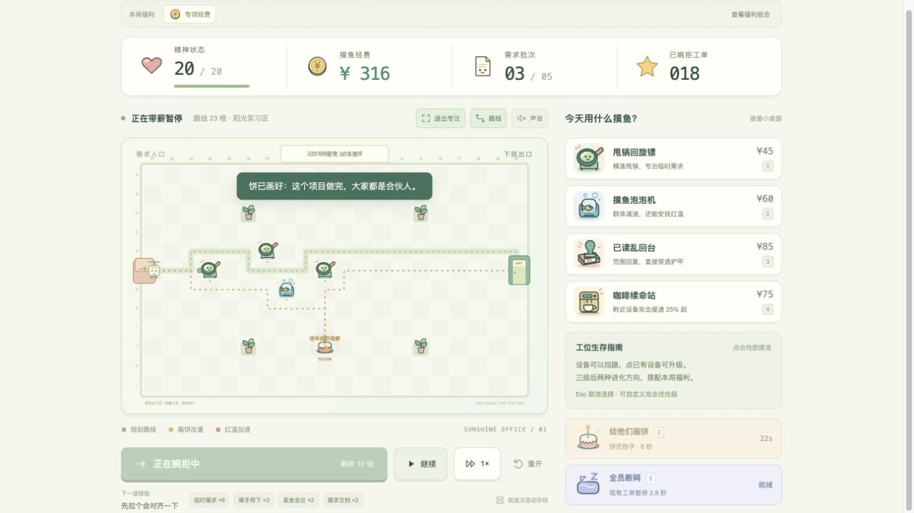
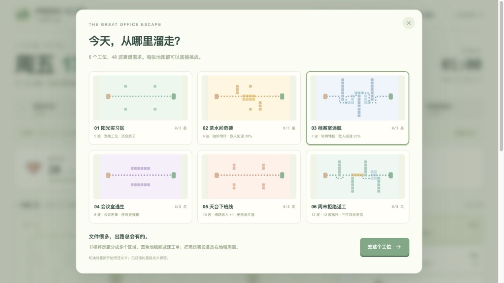
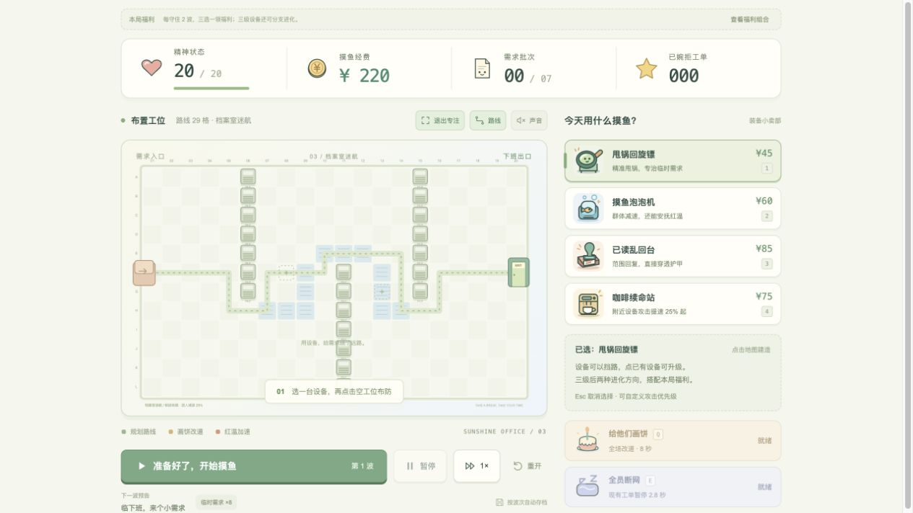

<div align="center">

# 周五 17:59 · 下班俱乐部

**把「就改一版」留在办公室，守住你的下班出口。**

原生 HTML / JavaScript · 单文件离线 · MIT 开源

[直接下载试玩](https://github.com/xiaom8413-afk/friday-1759/releases/download/v0.3.0/friday-1759.html) · [完整源码包](https://github.com/xiaom8413-afk/friday-1759/releases/tag/v0.3.0) · [实机画廊](docs/GALLERY.md) · [架构原理](docs/ARCHITECTURE.md)


**6 张地图　/　48 波挑战　/　8 条进化路线　/　12 项局内福利**

</div>

一款明亮、搞怪的办公室塔防。甩锅负责输出，摸鱼泡泡控制节奏，咖啡提供支援；一张“饼”还能改变工单的真实路线。**下载一个 HTML，用浏览器打开就能玩。** 不需要登录、后端或 API Key，游玩不联网、不调用 AI。

Friday 17:59 is an offline office tower-defense game with dynamic A* navigation, branching upgrades and tactical perks. Open one HTML file and play.

## 先看游戏，再看代码

### 工单会绕路，画饼会改道



设备不仅攻击，也会改变道路。让工单绕路能赚经费，绕得太久又会触发红温加速；你需要同时考虑路线长度、减速和火力覆盖。

<table>
<tr><td width="50%"></td><td width="50%"></td></tr>
<tr><td><b>一台设备，两条路线</b><br>升到三级后选择互斥进化，决定它怎样参与整套防线。</td><td><b>每两波，一次新选择</b><br>从火力、经济和技能福利中做取舍；最终波除外。</td></tr>
<tr><td></td><td></td></tr>
<tr><td><b>六关各有规则</b><br>开放工位、咖啡地砖、会议工单、天台经济与周末 Boss。</td><td><b>地形真的影响布防</b><br>书柜构成通道，地毯延缓工单；选位置也是策略。</td></tr>
</table>

> 上图来自正常界面操作，未修改经费或战局。更多图鉴、福利与战报见 [完整画廊](docs/GALLERY.md)。

## 30 秒开玩

1. [下载 friday-1759.html](https://github.com/xiaom8413-afk/friday-1759/releases/download/v0.3.0/friday-1759.html)。
2. 用 Chrome、Edge 或 Safari 打开下载的文件。
3. 选设备、点空工位布防，然后开启第一波。按 **Q** 画饼，按 **E** 全员断网。

建议电脑游玩。存档留在当前浏览器与本机；恢复的是波次检查点，进行中的一波需重打。下载后的文件可单独复制，源码入口 `index.html` 则需要同目录 CSS / JS。历史单文件版本位于 `versions/`。

## 游戏内容

- 8 种设备分支进化、12 项三选一福利、3 种特殊工单与 Boss 半血技能。
- 可切换攻击优先级，实时单机数据、战报、工单图鉴与福利组合一并可查。
- 奶油白、薄荷绿、珊瑚橙配色，专门绘制的 SVG 装备插画、角色、页头插画和 Canvas 办公室地图，无外部图标库、图片、字体。
- 6 张可直接选择的地图，合计 48 波；每关独立规则、初始预算、星级和通关记录。
- 咖啡续命站提高附近设备的攻击频率；全员断网技能给防线争取时间。
- 下一波敌人预告、三星结算、直接进入下一关、按波次自动存档。
- 保留实时 A* 改道、画饼、绕路收入、红温、会议自我内耗、三级升级、出售、倍速和自动暂停。

| 关卡 | 波次 | 独立规则 |
| --- | ---: | --- |
| 阳光实习区 | 5 | 开放工位，200 元初始预算，适合熟悉玩法 |
| 茶水间奇袭 | 6 | 咖啡地砖让工单加速 30% |
| 档案室迷航 | 7 | 书柜形成曲折通道；蓝色地毯减速 25% |
| 会议室逃生 | 8 | 第一波就有会议怪，开会间隔缩短 |
| 天台下班线 | 10 | 每档绕路收入增加到 ¥4；22 格就会红温 |
| 周末拒绝返工 | 12 | 更密集的工单，三场 Boss 战和混合地形 |

所有关卡都可以直接体验，无需先通关解锁。三星要求通关剩余精神至少 16，二星至少 8，其余成功通关为一星。重玩时保留最高星级。

## 战术进阶版：组合你的流派

**每守住两波（最终波除外），三选一领取本局福利。** 可先关闭窗口规划，但需要选择后才能开启下一波。12 项福利覆盖火力、射程、控制、经济、技能冷却和精神恢复；同一福利不会重复获得。新开局会生成不同组合；存档保留本次选项，刷新不会重抽。

**每种设备升到三级后，可花经费选择一个互斥进化方向。** 点击设备，再点“选择分支进化”。进化之后仍可出售，成本会计入返还额。

| 设备 | 方向 A | 方向 B |
| --- | --- | --- |
| 甩锅回旋镖 | 甩锅接力：向 2 个额外目标弹射 65% 伤害 | 责任狙击：射程 +1.7、伤害 +80%、攻击间隔 +35% |
| 摸鱼泡泡机 | 冰镇摸鱼：减速 70%，短暂定住非领导工单 | 情绪按摩：扩大范围，让目标额外承受 25% 伤害 |
| 已读乱回台 | 已读传染：附加 3 秒持续伤害，不重复叠加 | 格式粉碎：伤害 +50%，无视护盾，范围缩小 |
| 咖啡续命站 | 双倍浓缩：攻击频率加成提高至 70%，范围更大 | 带薪续杯：每波 ¥18 并修复 1 精神，全场修复上限 2 |

**优先级由你定。** 点击攻击设备，可选择“快到出口的 / 血量最高的 / 距离最近的 / 正在红温的”。下面会显示本台设备的有效伤害、击退数和发射次数。

**特殊工单有针对性解法。** 第 4 波开始可能出现护盾工单，第 5 波开始有治疗工单，第 6 波开始有套娃工单。套娃被消灭后分裂成两个更快的小需求，不会无限分裂，也不会重复产生绕路补贴。Boss 半血时会让附近同事加速 4 秒。选关后的下一波预告会给出实际敌人组成。

右上角 **战术面板** 包含：

- 本局战报：有效伤害、各设备贡献、收入、投入、漏怪、精神修复与使用的分支。伤害包含护盾，不计算过量伤害；已售设备的贡献保留。咖啡的增益贡献计入受益的攻击设备。
- 工单图鉴：8 类敌人的能力和应对方式。
- 福利组合：全部 12 项福利，以及本局已拥有的效果。

一种可尝试的搭配：**情绪按摩 + 甩锅接力 + 双倍浓缩**，先给敌群施加增伤，再弹射清场。另一种是 **责任狙击 + 长臂管辖 + 血量最高优先**，集中处理领导。

## 荒诞但有效的规则

**需求绕路，也算工时。** 每张工单相对向出口的直线进度，每多绕 6 格赚 ¥3，最多三档。累计走满 25 格会红温，速度提高 45%。泡泡暂时降低速度，并压制红温。天台关卡按其特殊数值执行。

**饼不必真，路线得真。** 按 Q 后点空格，所有还没吃过这张饼的工单都会先去那里，再找出口。饼持续 8 秒，冷却 22 秒。不要只在主路上画饼，试试偏离路线、靠近火力的位置。

**开会，坑自己人。** 紫色会议怪周期性强迫附近工单停顿 1.8 秒，领导除外。范围攻击可以趁机清场。

**咖啡加持。** 咖啡站不攻击，提供范围内 25% / 35% / 45% 的攻击频率加成。多个站只取最高加成，不叠加。设备右上角的小金点表示正在被咖啡加持；选中咖啡站可以查看覆盖范围和连接。

**全员断网。** 按 E，让当前在场的全部工单（包括领导）停顿 2.8 秒，冷却 30 秒。之后新入场的工单不受影响。每波结束重置两种技能的冷却。

## 操作

| 按键 | 操作 |
| --- | --- |
| 1 | 甩锅回旋镖 / ¥45：单体伤害 |
| 2 | 摸鱼泡泡机 / ¥60：范围减速、安抚 |
| 3 | 已读乱回台 / ¥85：范围伤害、无视护甲 |
| 4 | 咖啡续命站 / ¥75：支援附近设备 |
| Q | 选择位置画饼 |
| E | 全员断网 |
| Space | 开波 / 暂停；焦点在按钮上时执行该按钮 |
| Esc | 取消当前选择 |
| F | 专注模式，收起页头和关卡条 |
| 方向键 + Enter | 地图取得焦点后移动光标并操作 |

点击空格连续建造；点击已有设备升级或出售。最多三级，出售返还总投入的 70%。支持 1/2/3 倍速，音效默认关闭。

炮塔会挡路，但不能封死入口、出口、正在移动的工单或当前画饼目标。打印机、书柜和绿植也是障碍物。地砖可以建造设备。每波结束补发预算，每逢第 5 波及本关最终波出现领导，进入出口会扣 8 点精神状态。

窄屏可以横向滑动关卡条。建议电脑游玩，手机横屏更方便精确布防。

## 存档说明

- 新版兼容上一版波次存档，继续保留关卡星级；新增进化、优先级、福利、未领取选项和统计一并保存。
- 自动保存布置阶段的操作，以及**每波开始前**的完整布防、经费、精神状态和已完成波数。
- 刷新或重开浏览器后，点击“继续上次游戏”，恢复最近的波次检查点。进行中的一波需要重新打。
- 切换关卡或重开会覆盖当前检查点；各关最高星级和通关次数保留。
- 切到后台或打开说明、选关窗口时自动暂停，返回后点击继续。
- 存档只在当前浏览器、本机与同一来源内保存。直接打开文件与通过本地服务访问的存档可能不同。禁用本地存储时仍可游玩，界面会提示无法保存。

## 开发与验证

零第三方运行依赖。物理逻辑以固定 60 Hz 步长推进，渲染独立。采用四方向 A*，更新地图时保留正在行走的路径段，并验证连通性。

- `engine.js`：六关数据、寻路、战斗、经济、技能、检查点序列化。
- `art.js`：本项目绘制的 SVG 插画和控件。
- `renderer.js`：明亮地图、角色、弹道、粒子与状态反馈。
- `game.js`：界面、操作、关卡、存档、音效。
- `systems.js`：福利抽选、进化、战报和工单图鉴界面。
- `tests/`：引擎和完整关卡测试。

仅开发时需要 Node：

```sh
node --test tests/*.test.cjs
node build-standalone.cjs
```

39 项逻辑测试覆盖旧有机制、八种进化、福利、优先级、护盾、治疗、分裂、Boss 催办、伤害归属、新旧存档兼容，以及六关正常预算的完整通关。

后台无头浏览器另外验证了独立文件离线加载、领取福利、三级进化、攻击优先级、实际战斗、波次结算自动发福利、战报、图鉴、福利库、恢复存档及手机宽度布局。验证不打开桌面窗口，不接触用户浏览器资料，不发起外部网络请求。可选复现（Node 22+ / 支持原生 WebSocket 的版本）：

```sh
node tests/browser-smoke.cjs 周五1759.html
```

测试默认使用 macOS 的 Google Chrome；其他平台可设置 `FRIDAY_CHROME_BINARY` 指向 Chrome/Chromium 可执行文件。测试场景会使用独立临时资料目录并自动关闭浏览器；关卡通关测试使用真实预算，界面功能测试使用隔离的测试存档。

如需本地服务预览（双击独立文件不需要）：

```sh
python3 -m http.server 8766 --bind 127.0.0.1
```

打开 `http://127.0.0.1:8766` 即可。

## 开源与许可

源码、项目自有插画及文档采用 [MIT](LICENSE) 许可证。反馈问题请注明关卡、波次和浏览器。运行及存档边界见 [安全与隐私](SECURITY.md)。
